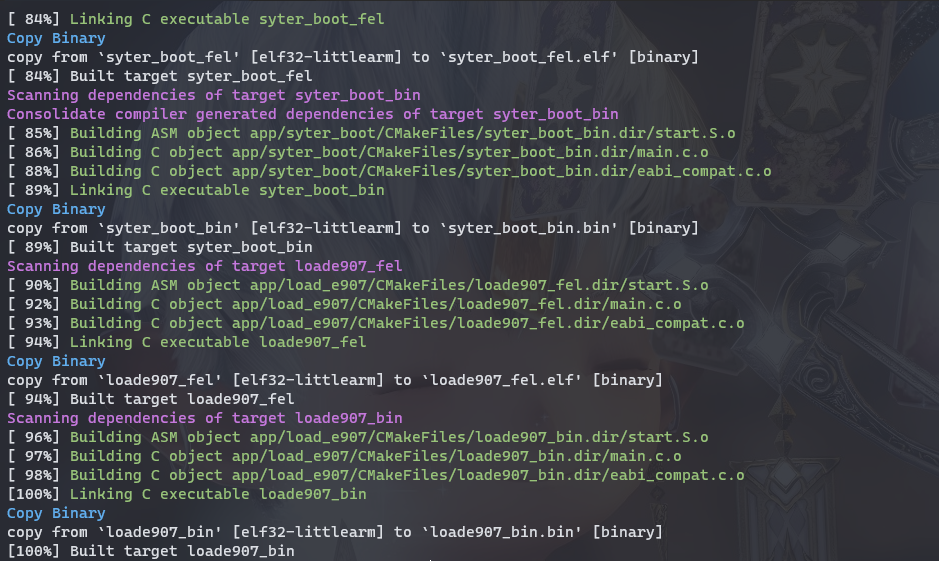
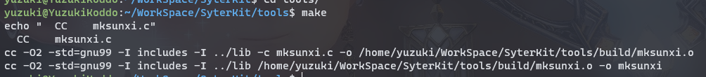
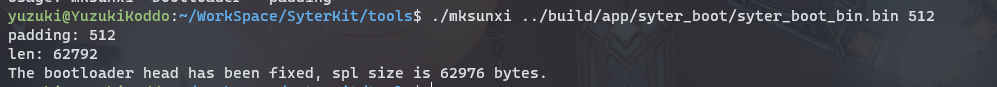
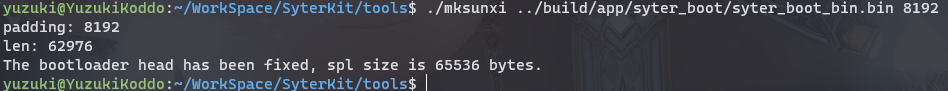

# SyterKit

SyterKit is a bare-metal framework designed for development boards like TinyVision or other chips such as v851se/v851s/v851s3/v853. SyterKit utilizes CMake as its build system and supports various applications and peripheral drivers. Additionally, SyterKit also has bootstrapping functionality, which enables it to replace U-Boot for fast booting (standard Linux 6.7 mainline boot time of 1.02s, significantly faster than traditional U-Boot's 6s boot time).

| Name            | Function                                                     | Path                  |
| --------------- | ------------------------------------------------------------ | --------------------- |
| hello world     | Minimal program example, prints Hello World                  | `app/hello_world`     |
| init dram       | Initializes the serial port and DRAM                         | `app/init_dram`       |
| read chip efuse | Reads chip efuse information                                 | `app/read_chip_efuse` |
| read chipsid    | Reads the unique ID of the chip                              | `app/read_chipsid`    |
| load e907       | Reads the small core firmware, starts the e907 core, and uses V851s as a large RISC-V microcontroller (E907 @ 600 MHz with 64MB memory) | `app/load_e907`       |
| syter boot      | Bootstrapping function that replaces U-Boot, enabling fast system startup for Linux | `app/syter_boot`      |
| syter amp       | Reads the small core firmware, starts the e907 core, loads the kernel, and runs Linux simultaneously on both e907 and a7 systems, which are heterogeneously integrated | `app/syter_amp`       |

## Getting Started

### Building SyterKit From Scratch

Building SyterKit is a straightforward process that only requires setting up the environment for compilation on a Linux operating system. The software packages required by SyterKit include:

- `gcc-arm-none-eabi`
- `CMake`

For commonly used Ubuntu systems, they can be installed using the following command:

```shell
sudo apt-get update
sudo apt-get install gcc-arm-none-eabi cmake build-essential -y
```

Then create a folder to store the compiled output files and navigate to it:

```shell
mkdir build
cd build
```

Finally, run the following commands to compile SyterKit:

```shell
cmake ..
make
```

The compiled executable files will be located in `build/app`.



The SyterKit project will compile two versions: firmware ending with `.elf` is for USB booting and requires bootloading by PC-side software, while firmware ending with `.bin` is for flashing and can be written into storage devices such as TF cards and SPI NAND.

### Creating TF Card Boot Firmware

Since the firmware to be written into storage devices requires alignment, a tool for alignment is provided here, located at `tools/mksunxi.c`.

#### Compiling mksunxi

Simply navigate to the folder `make`.



#### Aligning the Firmware for TF Card

For devices like TF cards, it is recommended to align them to 512.

Execute the command `mksunxi xxx.bin 512` to perform alignment. For example, let's align the `syter_boot_bin.bin` file.



After aligning the firmware, you can flash it into the TF card. For the V851s platform, you can write it to either an 8K offset or a 128K offset. Generally, if the TF card uses MBR format, write it with an 8K offset. If it uses GPT format, write it with a 128K offset. Assuming `/dev/sdb` is the target TF card, you can use the following command to write it with an 8K offset:

```shell
sudo dd if=syter_boot_bin.bin of=/dev/sdb bs=1024 seek=8
```

If it is a GPT partition table, you need to write it with a 128K offset:

```shell
sudo dd if=syter_boot_bin.bin of=/dev/sdb bs=1024 seek=128
```

#### Aligning the Firmware for SPI NAND

For devices like SPI NAND, it is recommended to align them to 8192.

Execute the command `mksunxi xxx.bin 8192` to perform alignment. For example, let's align the `syter_boot_bin.bin` file.



Next, we need to create the firmware for SPI NAND by writing SyterKit to the corresponding positions:

```shell
dd if=syter_boot_bin.bin of=spi.img bs=2k
dd if=syter_boot_bin.bin of=spi.img bs=2k seek=32
dd if=syter_boot_bin.bin of=spi.img bs=2k seek=64
```

You can also include the Linux kernel and device tree in the firmware:

```shell
dd if=sunxi.dtb of=spi.img bs=2k seek=128     # DTB on page 128
dd if=zImage of=spi.img bs=2k seek=256        # Kernel on page 256
```

Use the xfel tool to flash the created firmware into SPI NAND:

```shell
xfel spinand write 0x0 spi.img
```

#### Aligning the Firmware for SPI NOR

For devices like SPI NOR, it is recommended to align them to 8192.

Execute the command `mksunxi xxx.bin 8192` to perform alignment. For example, let's align the `syter_boot_bin.bin` file.


Next, we need to create the firmware for SPI NOR by writing SyterKit to the corresponding positions:

```shell
dd if=syter_boot_bin.bin of=spi.img bs=2k
dd if=syter_boot_bin.bin of=spi.img bs=2k seek=32
dd if=syter_boot_bin.bin of=spi.img bs=2k seek=64
```

You can also include the Linux kernel and device tree in the firmware:

```shell
dd if=sunxi.dtb of=spi.img bs=2k seek=128     # DTB on page 128
dd if=zImage of=spi.img bs=2k seek=256        # Kernel on page 256
```

Use the xfel tool to flash the created firmware into SPI NOR:

```shell
xfel spinor write 0x0 spi.img
```


# SyterKit

SyterKit 是一个纯裸机框架，用于 TinyVision 或者其他 v851se/v851s/v851s3/v853 等芯片的开发板，SyterKit 使用 CMake 作为构建系统构建，支持多种应用与多种外设驱动。同时 SyterKit 也具有启动引导的功能，可以替代 U-Boot 实现快速启动（标准 Linux6.7 主线启动时间 1.02s，相较于传统 U-Boot 启动快 6s）。

## 应用

| 名称            | 功能                                                         | 路径                  |
| --------------- | ------------------------------------------------------------ | --------------------- |
| hello world     | 最小化程序示例，打印 Hello World                             | `app/hello_world`     |
| init dram       | 初始化串口并初始化 DRAM                                      | `app/init_dram`       |
| read chip efuse | 读取芯片 efuse 信息                                          | `app/read_chip_efuse` |
| read chipsid    | 读取芯片唯一 ID                                              | `app/read_chipsid`    |
| load e907       | 读取小核固件，并且启动 e907 核心，将 V851s 作为大号 RISC-V 单片机使用（E907@600MHz 64M内存） | `app/load_e907`       |
| syter boot      | 启动引导，完美代替 U-Boot 功能，快速启动 Linux 系统          | `app/syter_boot`      |
| syter amp       | 读取小核固件，启动 e907 核心，并且读取 Kernel 启动 Linux 系统，e907 与 a7 双系统异构同时运行 | `app/syter_amp`       |

## 开始使用

### 从零构建 SyterKit 

构建 SyterKit 非常简单，只需要在 Linux 操作系统中安装配置环境即可编译。SyterKit 需要的软件包有：

- `gcc-arm-none-eabi`
- `CMake`

对于常用的 Ubuntu 系统，可以通过如下命令安装

```shell
sudo apt-get update
sudo apt-get install gcc-arm-none-eabi cmake build-essential -y
```

然后新建一个文件夹存放编译的输出文件，并且进入这个文件夹

```shell
mkdir build
cd build
```

然后运行命令编译 SyterKit

```shell
cmake ..
make
```

编译后的可执行文件位于 `build/app` 中


同一个项目工程 SyterKit 会编译两个版本，`elf` 结尾的固件为 USB 引导固件，需要电脑上位软件进行引导加载，`bin` 结尾的固件为刷写固件，可以刷入 TF 卡，SPI NAND 等储存器。

### 制作 TF 卡启动固件

由于刷写到存储器的固件需要进行对齐操作，所以这里提供一个工具进行对齐。位于 `tools/mksunxi.c`

#### 编译 mksunxi 

进入文件夹 `make ` 即可


#### 对 TF 卡启动固件进行对齐

对于 TF 卡这样的设备，需要 512 对齐。

执行命令 `mksunxi xxx.bin 512` 即可对齐，例如这里我们对 `syter_boot_bin.bin` 进行对齐操作


对齐后的固件可以刷入TF卡内使用，对于 V851s 平台，可以将其写入 8K 偏移位或者 128K 偏移位。一般来说如果TF卡使用的是 MBR 格式，写 8K 偏移，如果是 GPT 格式，写128K 偏移。这里假设 `/dev/sdb` 是目标 TF 卡。写入 8K 偏移位

```shell
sudo dd if=syter_boot_bin.bin of=/dev/sdb bs=1024 seek=8
```

如果是 GPT 分区表，需要写入 128K 偏移量

```shell
sudo dd if=syter_boot_bin.bin of=/dev/sdb bs=1024 seek=128
```

#### 对 SPI NAND 启动固件进行对齐

对于 SPI NAND 这样的设备，需要 8192 对齐。

执行命令 `mksunxi xxx.bin 8192` 即可对齐，例如这里我们对 `syter_boot_bin.bin` 进行对齐操作


然后我们需要制作 SPI NAND 的固件，将 SyterKit 写入对应位置制作固件

```shell
dd if=syter_boot_bin.bin of=spi.img bs=2k
dd if=syter_boot_bin.bin of=spi.img bs=2k seek=32
dd if=syter_boot_bin.bin of=spi.img bs=2k seek=64
```

同时也可以把 Linux 内核与设备树一同写入固件中

```shell
dd if=sunxi.dtb of=spi.img bs=2k seek=128     # DTB on page 128
dd if=zImage of=spi.img bs=2k seek=256        # Kernel on page 256
```

制作完成的固件可以使用 xfel 工具刷入 SPI NAND

```shell
xfel spinand write 0x0 spi.img
```

#### 对 SPI NOR 启动固件进行对齐

对于 SPI NOR 这样的设备，需要 8192 对齐。

执行命令 `mksunxi xxx.bin 8192` 即可对齐，例如这里我们对 `syter_boot_bin.bin` 进行对齐操作


然后我们需要制作 SPI NOR 的固件，将 SyterKit 写入对应位置制作固件

```shell
dd if=syter_boot_bin.bin of=spi.img bs=2k
dd if=syter_boot_bin.bin of=spi.img bs=2k seek=32
dd if=syter_boot_bin.bin of=spi.img bs=2k seek=64
```

同时也可以把 Linux 内核与设备树一同写入固件中

```shell
dd if=sunxi.dtb of=spi.img bs=2k seek=128     # DTB on page 128
dd if=zImage of=spi.img bs=2k seek=256        # Kernel on page 256
```

制作完成的固件可以使用 xfel 工具刷入 SPI NOR

```shell
xfel spinor write 0x0 spi.img
```
